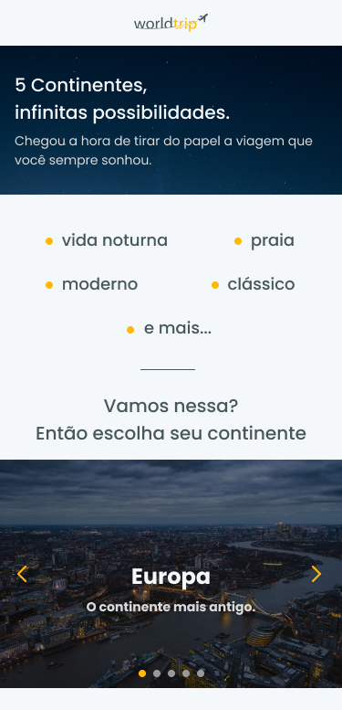
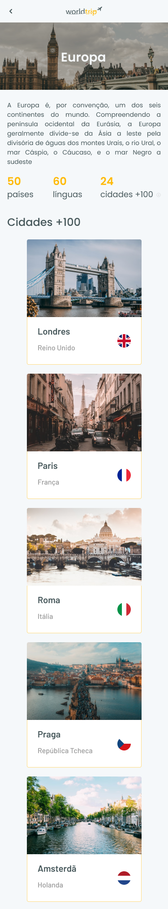

<p align="center">
  

  

  <a href="https://twitter.com/PauloRougdries/">
    
  </a>
  
  <a href="https://github.com/paulosoares7/worldtrip_next/commits/main">
    
  </a>
    
   
   <a href="https://github.com/paulosaores7/worldtrip_next/stargazers">
    
  </a>
  
 
</p>
<h1 align="center">
    
</h1>

<h4 align="center"> 
	🚧  Worldtrip 🧭 Em construção 🗺 🚧
</h4>

<p align="center">
 <a href="#-sobre-o-projeto">Sobre</a> •
 <a href="#-layout">Layout</a> • 
 <a href="#-como-executar-o-projeto">Como executar</a> • 
 <a href="#-tecnologias">Tecnologias</a> • 
 <a href="#-contribuidores">Contribuidores</a> • 
 <a href="#-autor">Autor</a> • 
 <a href="#user-content--licença">Licença</a>
</p>


## 💻 Sobre o desafio

🧭 Worldtrip - é uma otima opção para quem deseja descobrir os melhores lugares para viajar e vivenciar experiências únicas.


Projeto desenvolvido para o desafio proposto pela [Rocketseat](https://rocketseat.com.br/), ao longo da trilha **Ignite** 🚀. O objetivo deste desafio foi criar um blog do zero, testar as habilidades com a biblioteca [Chakra UI](https://chakra-ui.com).
O Ignite é uma experiência online com muito conteúdo prático, desafios e hacks onde o conteúdo é privado.

O critérios de avaliação para a criação deste blog são:

[x]   **Página home**
[x]   **Listar continentes (Carrossel)**
[x]   **Páginas contendo informções dos continentes separadamente**
[x]   **Utilizar conceitos de SSG**
[]   **Deixar telas responsivas**


---

## 🎨 Layout

O layout da aplicação está disponível no Figma:

<a href="https://www.figma.com/file/9JH0RaDvhRYtNVYhMDjs1W/Desafio-1-Módulo-4-ReactJS-(Copy)?node-id=0%3A1">
  
</a>


### Mobile

<p align="center">
  

  
</p>

### Web

<p align="center" style="display: flex; align-items: flex-start; justify-content: center;">
  

  
</p>

---

## 🚀 Como executar o Worldtrip


### Pré-requisitos

Antes de começar, você vai precisar ter instalado em sua máquina as seguintes ferramentas:
[Git](https://git-scm.com), [Node.js](https://nodejs.org/en/). 
Além disto é bom ter um editor para trabalhar com o código como [VSCode](https://code.visualstudio.com/)

#### 🧭 Rodando a aplicação web

```bash

# Clone este repositório
$ git clone git@github.com:paulosoares7/worldtrip_next.git

# Acesse a pasta do projeto no seu terminal/cmd
$ cd worldtrip_next

# Instale as dependências
$ npm install

# Execute a aplicação em modo de desenvolvimento
$ npm run start

# A aplicação será aberta na porta:3000 - acesse http://localhost:3000

```

---

## 🛠 Tecnologias

As seguintes ferramentas foram usadas na construção do projeto:

#### **Website**  ([Next](https://https://nextjs.org)  +  [TypeScript](https://www.typescriptlang.org/))

-   **[Chackra UI](https://chakra-ui.com)**
-   **[React Icons](https://react-icons.github.io/react-icons/)**
-   **[Swiper](https://swiperjs.com)**

> Veja o arquivo  [package.json](https://github.com/paulosoares7/worldtrip_next/blob/main/package.json)

#### [](https://github.com/paulosoares7/worldtrip_next#utilit%C3%A1rios)**Utilitários**

-   Editor:  **[Visual Studio Code](https://code.visualstudio.com/)**  → Extensions:  **[SQLite](https://marketplace.visualstudio.com/items?itemName=alexcvzz.vscode-sqlite)**
-   Fontes:  **[Poppins](https://fonts.google.com/specimen/Poppins)**

---

## 🦸 Autor

 
 <br />
 <sub><b>Paulo Soares</b></sub>
 <br />

[](https://twitter.com/PauloRougdries) [](https://www.linkedin.com/in/paulosoares7/) 
[](mailto:paulosoaresrodrigues@outlook.com)


---

## 📝 Licença

Este projeto esta sobe a licença [MIT](./LICENSE).

Feito com ❤️ por Paulo Soares 👋🏽 [Entre em contato!](https://www.linkedin.com/in/paulosoares7)

---

## Mostre seu apoio

Dê um ⭐ se este projeto o ajudou!